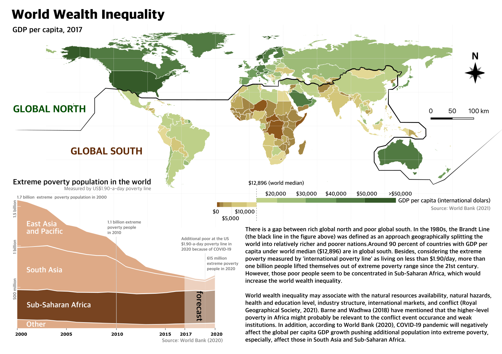
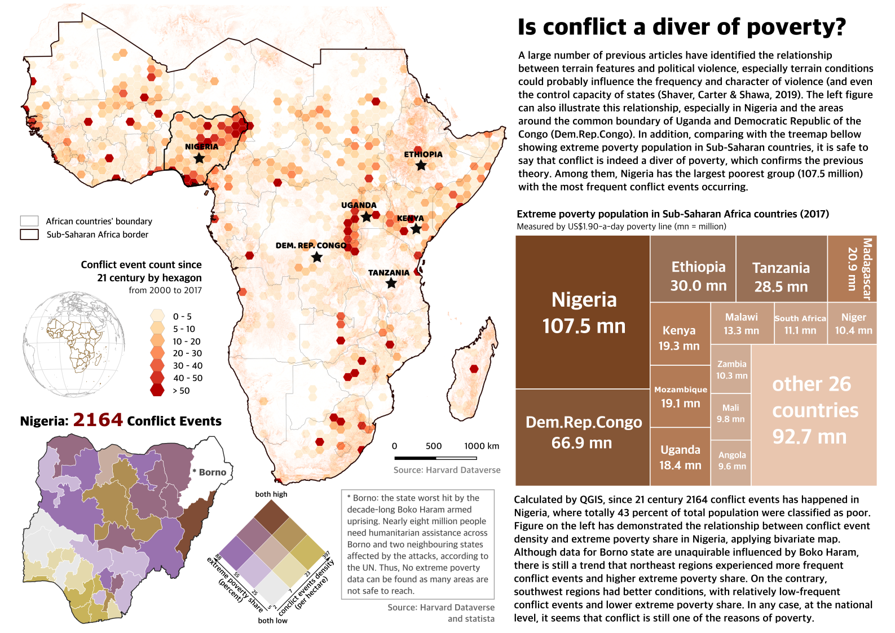
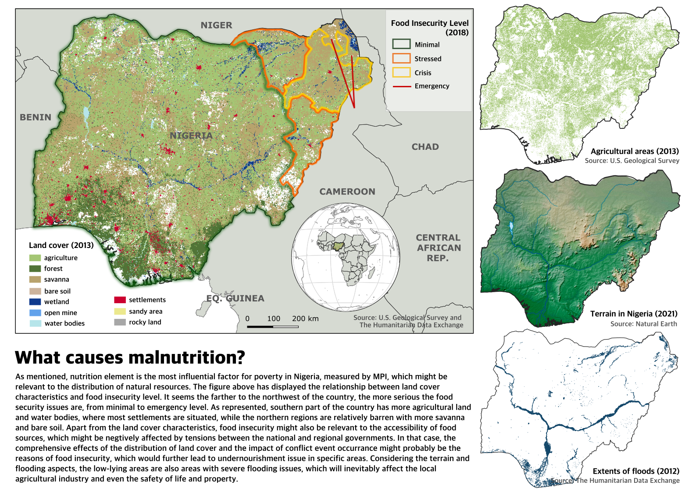

# GEOG0162 Individual mapping - poverty investigation


```{r echo=FALSE, out.width = "500pt", fig.align='center', cache=TRUE}
 
```
```{r echo=FALSE, out.width = "500pt", fig.align='center', cache=TRUE}
 
```
```{r echo=FALSE, out.width = "500pt", fig.align='center', cache=TRUE}
 
```
```{r echo=FALSE, out.width = "500pt", fig.align='center', cache=TRUE}
knitr::include_graphics('png/3.png') 
```
```{r echo=FALSE, out.width = "500pt", fig.align='center', cache=TRUE}
 
```
```{r echo=FALSE, out.width = "500pt", fig.align='center', cache=TRUE}
knitr::include_graphics('png/5.png') 
```
```{r echo=FALSE, out.width = "500pt", fig.align='center', cache=TRUE}
 
```

