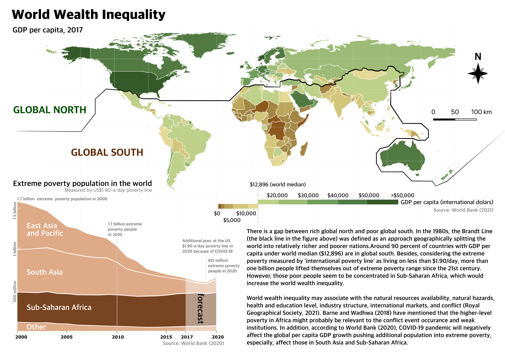
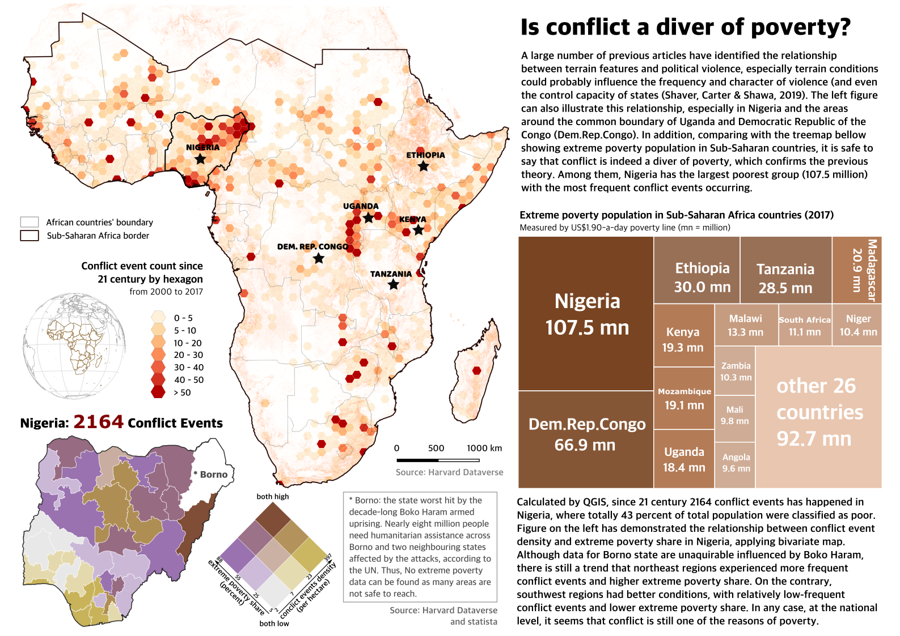
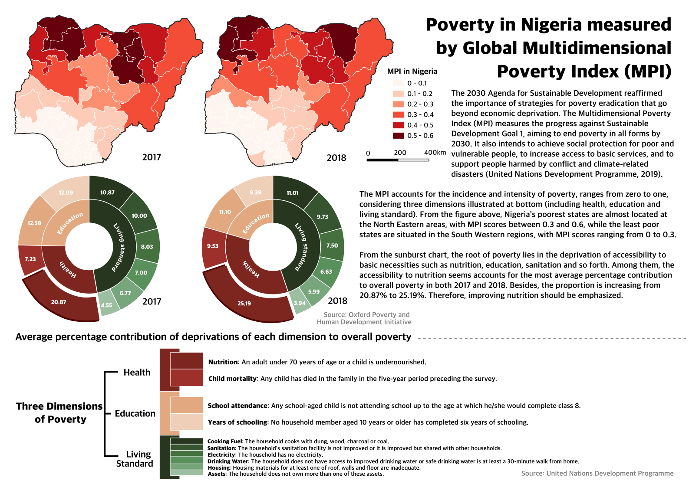
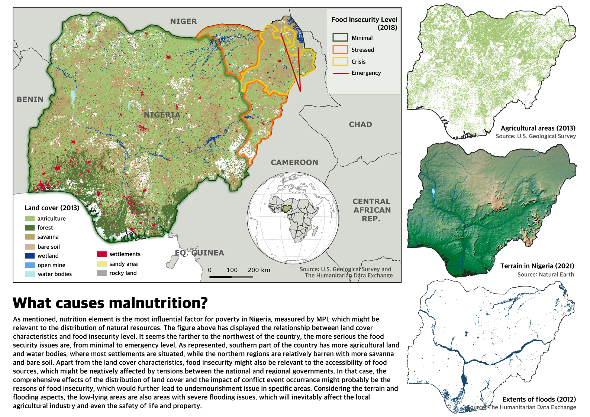
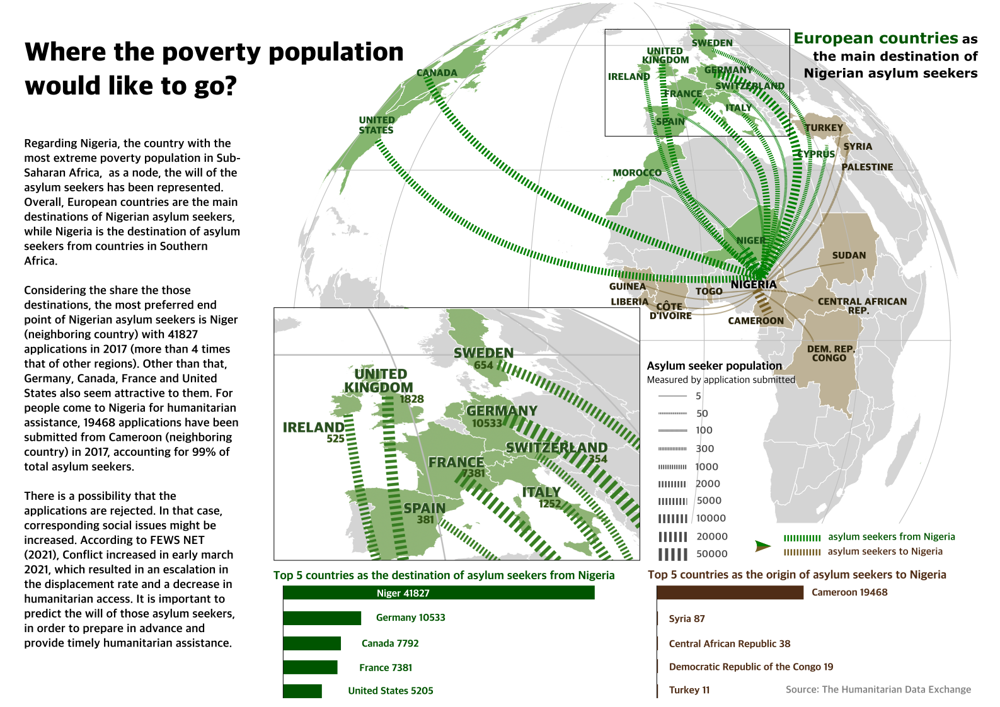

$$\\\\[0.2in]$$

## **GEOG0162 Individual mapping - poverty investigation**


According to World Bank Group (2020), COVID-19, armed conflict, and climate change may drive additional people into poverty and global extreme poverty might be increasingly concentrated. Therefore, nations over the world will need to prepare forward to provide humanitarian assistance help vulnerable citizens and restart inclusive growth. 

This report will map the poverty at **global, regional and national** levels, identifying the poorest regions. Then, based on the previous literature, possible reasons of poverty will be discussed. The main audiences would be those who concern about the **global inequality** or **humanitarian assistance**. 

$$\\\\[0.2in]$$

### ***Map 1***
```{r echo=FALSE, out.width = "1000pt", fig.align='center', cache=TRUE}
 
```

$$\\\\[0.1in]$$

### ***Map 2***
```{r echo=FALSE, out.width = "1000pt", fig.align='center', cache=TRUE}
 
```

$$\\\\[0.1in]$$

### ***Map 3***
```{r echo=FALSE, out.width = "1000pt", fig.align='center', cache=TRUE}
 
```

$$\\\\[0.1in]$$

### ***Map 4***
```{r echo=FALSE, out.width = "1000pt", fig.align='center', cache=TRUE}
 
```

$$\\\\[0.1in]$$

### ***Map 5***
```{r echo=FALSE, out.width = "1000pt", fig.align='center', cache=TRUE}
 
```

$$\\\\[0.1in]$$

### ***Self-critique***
```{r echo=FALSE, out.width = "1000pt", fig.align='center', cache=TRUE}
 
```

$$\\\\[0.1in]$$

